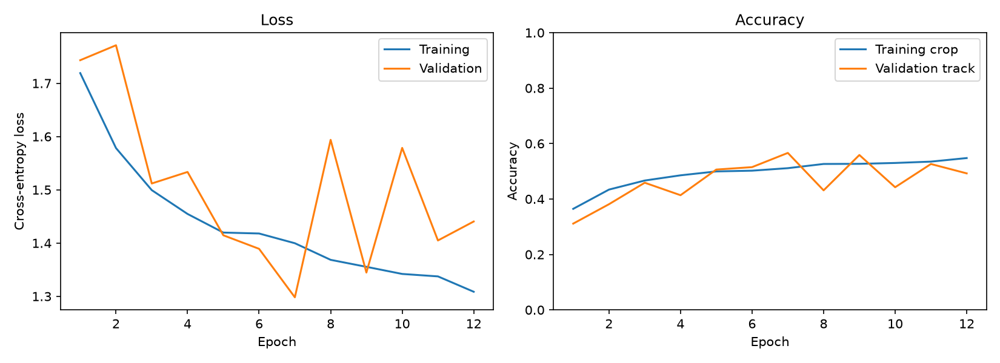
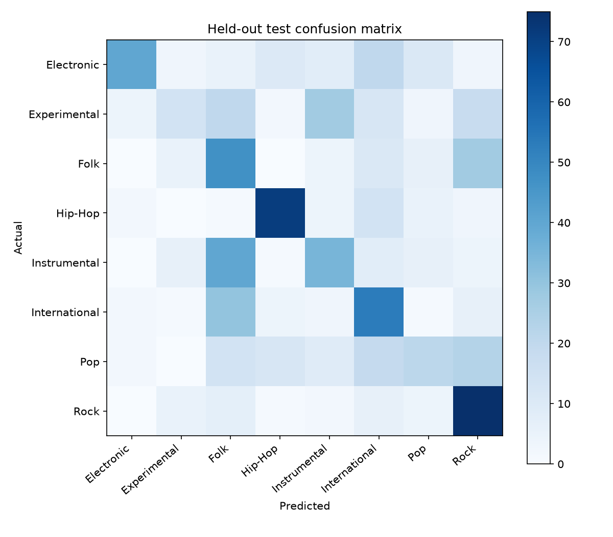

# FMA Small CNN evaluation

## Dataset and method

The model was trained on the [FMA Small dataset](https://github.com/mdeff/fma), introduced in the [FMA paper](https://arxiv.org/abs/1612.01840). The official split keeps artists separate across training, validation, and test sets. FMA audio uses artist-selected licenses; the audio is not included in this repository.

Usable tracks: 6,394 training, 800 validation, and 800 test. 6 source clips were skipped and are listed below. A fixed seed of 42 was used. The best checkpoint was selected at epoch 7 using validation loss, and the held-out test set was evaluated afterward.

Audio was decoded to mono 22,050 Hz and represented as a 128-band log-mel spectrogram (FFT 2,048, hop 512). The four-block CNN trained on random three-second crops. Track-level predictions average logits from ten evenly spaced crops before softmax.

## Held-out test results

- Accuracy: **44.5%**
- Macro F1: **0.432**
- Cross-entropy loss: **1.496**
- Validation accuracy at the selected checkpoint: **56.6%**

| Genre | Precision | Recall | F1 | Tracks |
| --- | ---: | ---: | ---: | ---: |
| Electronic | 0.800 | 0.400 | 0.533 | 100 |
| Experimental | 0.412 | 0.140 | 0.209 | 100 |
| Folk | 0.287 | 0.470 | 0.356 | 100 |
| Hip-Hop | 0.703 | 0.710 | 0.706 | 100 |
| Instrumental | 0.380 | 0.350 | 0.365 | 100 |
| International | 0.371 | 0.530 | 0.436 | 100 |
| Pop | 0.368 | 0.210 | 0.268 | 100 |
| Rock | 0.472 | 0.750 | 0.579 | 100 |

## Interpretation

The held-out test accuracy is lower than validation accuracy at the selected checkpoint. Performance also varies considerably by genre; inspect the per-genre scores and confusion matrix before using a prediction. This is a research baseline for FMA Small's eight labels, rather than a calibrated measure of every style present in a song.

## Figures

## Skipped source tracks

| Track ID | Reason |
| ---: | --- |
| 98565 | Audio must be at least three seconds long. |
| 98567 | Audio must be at least three seconds long. |
| 98569 | Audio must be at least three seconds long. |
| 99134 | Could not read this audio file. Check that it contains valid audio. |
| 108925 | Could not read this audio file. Check that it contains valid audio. |
| 133297 | Could not read this audio file. Check that it contains valid audio. |

Scores describe this dataset's eight single-label genres and may not represent every genre in an uploaded song.
